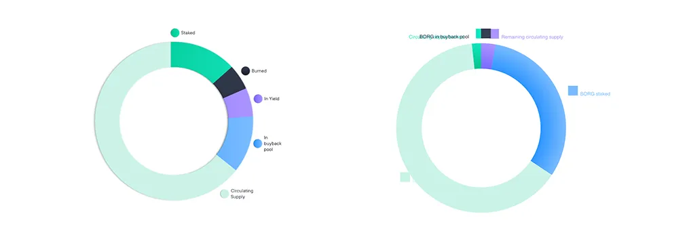

<br/>
Hello SwissBorg 👋 Thanks for taking to time to review my technical challange - I appreciate the time and consideration. You can view the tech challange at the link below, or obvisouly can clone it and run it locally.

<br/>🖥 https://swissborg.vercel.app/

Tech used:
<br/>Nextjs
<br/>CoinGecko API
<br/>Chartjs
<br/>Stitches

<br/>One thing to note, since I'm using real data, is as I was working through the labels on donut chart, I felt that the current lockup was not going to work with the up-to-date data. Labels would overlap or look wonky from a design perspective - that is why I chose to move the legend to the bottom of the chart.
<br/><br/>

<br/>If you have any questions or would like to reach out, please don't hesitate. Otherwise you can connect with me here:

<br/>[https://tylerstober.com](https://tylerstober.com)
<br/>[https://www.linkedin.com/in/tyler-stober/](https://www.linkedin.com/in/tyler-stober/)
<br/>stobertg@gmail.com
<br/>

## Getting Started

How to run:

```bash
yarn install
yarn dev

Add CoinGecko API to your .env.local file as NEXT_PUBLIC_COINGECKO_API
```

Open [http://localhost:3000](http://localhost:3000) with your browser to see the result.


